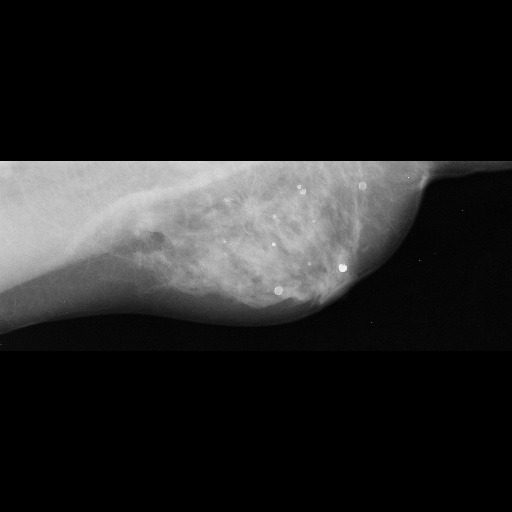
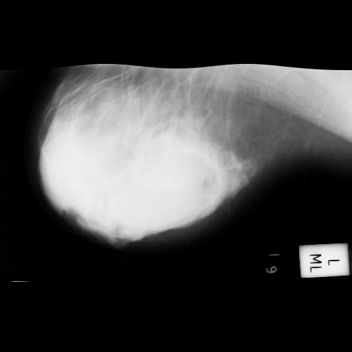

<h2>Tensorflow-Image-Segmentation-MIAS-Mammogram (2025/04/26)</h2>
Sarah T. Arai 
Software Laboratory antillia.com  
This is the first experiment of Image Segmentation for <b>Malignant MIAS Mammogram</b>
 based on  
the latest <a href="https://github.com/sarah-antillia/Tensorflow-Image-Segmentation-API">Tensorflow-Image-Segmentation-API</a>, 
and our pre-augmented 
<a href="https://drive.google.com/file/d/1i0_AnBdyRyQFFfYFVR4KOp0-4ltPPWPc/view?usp=sharing">Augmented-MIAS-Mammogram-ImageMaskDataset.zip .</a>
 
 
<b>Data Augmentation Strategy:</b> 
To address the limited size of the original Malignant MIAS Mammogram dataset, 
we employed an offline augmentation tool <a href="./generator/ImageMaskDatasetGenerator.py">ImageMaskDatasetGenerator.py</a> to enhance segmentation performance, which supports the following aumentation methods. 
<li>Vertical flip</li>
<li>Horizontal flip</li>
<li>Rotation</li>
<li>Shrinks</li>
<li>Shears</li> 
<li>Deformation</li>
<li>Distortion</li>
<li>Barrel distortion</li>
<li>Pincushion distortion</li>
 
Please see also the following tools  
<li><a href="https://github.com/sarah-antillia/Image-Deformation-Tool">Image-Deformation-Tool</a></li>
<li><a href="https://github.com/sarah-antillia/Image-Distortion-Tool">Image-Distortion-Tool</a></li>
<li><a href="https://github.com/sarah-antillia/Barrel-Image-Distortion-Tool">Barrel-Image-Distortion-Tool</a></li>
 

Actual Image Segmentation for Images of 512x512 pixels 
As shown below, the inferred masks look slightly similar to the ground truth masks.
<table>
<tr>
<th>Input: image</th>
<th>Mask (ground_truth)</th>
<th>Prediction: inferred_mask</th>
</tr>
<tr>
<td></td>
<td></td>
<td></td>
</tr>

<tr>
<td></td>
<td></td>
<td></td>
</tr>
<tr>
<td></td>
<td></td>
<td></td>
</tr>

</table>

 
In this experiment, we used the simple UNet Model 
<a href="./src/TensorflowUNet.py">TensorflowSlightlyFlexibleUNet</a> for this HRFSegmentation Model. 
As shown in <a href="https://github.com/sarah-antillia/Tensorflow-Image-Segmentation-API">Tensorflow-Image-Segmentation-API</a>.
you may try other Tensorflow UNet Models: 

<li><a href="./src/TensorflowSwinUNet.py">TensorflowSwinUNet.py</a></li>
<li><a href="./src/TensorflowMultiResUNet.py">TensorflowMultiResUNet.py</a></li>
<li><a href="./src/TensorflowAttentionUNet.py">TensorflowAttentionUNet.py</a></li>
<li><a href="./src/TensorflowEfficientUNet.py">TensorflowEfficientUNet.py</a></li>
<li><a href="./src/TensorflowUNet3Plus.py">TensorflowUNet3Plus.py</a></li>
<li><a href="./src/TensorflowDeepLabV3Plus.py">TensorflowDeepLabV3Plus.py</a></li>
 

<h3>1 Dataset Citation</b></h3>
MIAS 2015

<b>About Dataset</b> 
<b>Citation</b> 
Suckling, J., Parker, J., Dance, D., Astley, S., Hutt, I., Boggis, C., Ricketts, I., et al.  
(2015). Mammographic Image Analysis Society (MIAS) database v1.21 [Dataset]. 
 https://www.repository.cam.ac.uk/handle/1810/250394 
 
<b>Description</b> 
The Mammographic Image Analysis Society database of digital mammograms (v1.21).  
Contains the original 322 images (161 pairs) at 50 micron resolution in "Portable Gray Map" (PGM) format and associated truth data. 
 
This record will be updated with publication details. 
 
This record is licensed under a CC BY licence.  
<b>Format</b> 
00README.pdf and original article in PDF format Digital mammograms are in PGM format 
Keywords 
Mammography, MIAS, database, digital mammograms 
Sponsorship 
This work was supported by the Mammographic Image Analysis Society with authors contributing their time and facilities  
free-of-charge [grant number RNAG/302]. 

 

<h2>2 Augmented MIAS-Mammogram Dataset </h2>
Please download the dataset from the google drive <a href="https://drive.google.com/file/d/1i0_AnBdyRyQFFfYFVR4KOp0-4ltPPWPc/view?usp=sharing">
Augmented-MIAS-Mammogram-ImageMaskDataset.zip</a>,
expand it and place it under ./dataset to be.
<pre>
./dataset
└─Augmented-MIAS-Mammogram
    ├─test
    │   ├─images
    │   └─masks
    ├─train
    │   ├─images
    │   └─masks
    └─valid
        ├─images
        └─masks
</pre>
This is a 512x512 pixels JPG images and their corresponding masks dataset for Malignant MIAS Mammogram dataset.
 
 
<b>4K Malignant MIAS Mammogram images sample</b> 

 
<b>4K Malignant MIAS Mammogram masks sample (red circles)</b> 

 
 
The original MIAS PGM images have a width exceeding 4K pixels, which is likely too large for a basic UNet model. 
Therefore, we created a 512x512 pixel dataset by downscaling these images.

   
On the derivation of this dataset, please refer to the following Python scripts in <a href="./generator">generator</a> folder. 
<li> <a href="./generator/MalignantImageMaskExtractor.py">MalignantImageMaskExtractor.py</a></li>
<li> <a href="./generator/ImageMaskDatasetGenerator.py">ImageMaskDatasetGenerator.py</a></li>
<li> <a href="./generator/split_master.py">split_master.py</a></li>

 
<b>Augmented-MIAS-Mammogram Statistics</b> 
 
 
As shown above, the number of images in this dataset may not be sufficient for our segmentation  model.
 
 
<b>Train_images_sample</b> 

 
<b>Train_masks_sample</b> 

 
<h3>
3 Train TensorflowUNet Model
</h3>
 We have trained TensorflowUNet Model by using the following
<a href="./projects/TensorflowSlightlyFlexibleUNet/Augmented-MIAS-Mammogram/train_eval_infer.config"> <b>train_eval_infer.config</b></a> file.  
Please move to ./projects/TensorflowSlightlyFlexibleUNet/Augmented-MIAS-Mammogram and run the following bat file. 
<pre>
>1.train.bat
</pre>
, which simply runs the following command. 
<pre>
>python ../../../src/TensorflowUNetTrainer.py ./train_eval_infer.config
</pre>

<b>Model parameters</b> 
Enabled Batch Normalization. 
Defined a small <b>base_filters=16</b> and large <b>base_kernels=(5,5)</b> for the first Conv Layer of Encoder Block of 
<a href="./src/TensorflowUNet.py">TensorflowUNet.py</a> 
and a large num_layers (including a bridge between Encoder and Decoder Blocks).
<pre>
[model]
base_filters   = 16
base_kernels   = (5,5)
num_layers     = 8
dilation       = (2,2)
</pre>

<b>Learning rate</b> 
Defined a small learning rate.  
<pre>
[model]
learning_rate  = 0.00007
</pre>

<b>Online augmentation</b> 
Disabled our online augmentation tool. 
<pre>
[model]
model         = "TensorflowUNet"
generator     = False
</pre>

<b>Loss and metrics functions</b> 
Specified "bce_dice_loss" and "dice_coef". 
<pre>
[model]
loss           = "bce_dice_loss"
metrics        = ["dice_coef"]
</pre>
<b >Learning rate reducer callback</b> 
Enabled learing_rate_reducer callback, and a small reducer_patience.
<pre> 
[train]
learning_rate_reducer = True
reducer_factor     = 0.4
reducer_patience   = 4
</pre>

<b>Dataset class</b> 
Specified ImageMaskDataset class.
<pre>
[dataset]
datasetclass  = "ImageMaskDataset"
resize_interpolation = "cv2.INTER_LINEAR"
</pre>

<b>Early stopping callback</b> 
Enabled early stopping callback with patience parameter.
<pre>
[train]
patience      = 10
</pre>

<b>Inference</b> 
Used the 512x512 pixels in test dataset of Augmented-MIAS-Mammogram as a mini_test dataset for our inference images.
<pre>
[infer] 
images_dir    = "./mini_test/images"
output_dir    = "./mini_test_output"
</pre>

<b>Epoch change inference callbacks</b> 
Enabled epoch_change_infer callback. 
<pre>
[train]
epoch_change_infer      = True
epoch_change_infer_dir  = "./epoch_change_infer"
epoch_change_tiledinfer = False
epoch_change_tiledinfer_dir = "./epoch_change_tiledinfer"
num_infer_images       = 6
</pre>

By using this callback, on every epoch_change, the epoch change tiled inference procedure can be called
 for 6 images in <b>mini_test</b> folder. This will help you confirm how the predicted mask changes 
 at each epoch during your training process.    

<b>Epoch_change_tiled_inference output at starting (1,2,3)</b> 
 
 
 
<b>Epoch_change_tiled_inference output at ending (77,78,79)</b> 
 
 
 

In this experiment, the training process was terminated at epoch 79 by Early-Stopping callback.  
 
 

<a href="./projects/TensorflowSlightlyFlexibleUNet/Augmented-MIAS-Mammogram/eval/train_metrics.csv">train_metrics.csv</a> 
 

 
<a href="./projects/TensorflowSlightlyFlexibleUNet/Augmented-MIAS-Mammogram/eval/train_losses.csv">train_losses.csv</a> 
 

 

<h3>
4 Evaluation
</h3>
Please move to a <b>./projects/TensorflowSlightlyFlexibleUNet/Augmented-MIAS-Mammogram</b> folder, 
and run the following bat file to evaluate TensorflowUNet model for Augmented-MIAS-Mammogram/test. 
<pre>
./2.evaluate.bat
</pre>
This bat file simply runs the following command.
<pre>
python ../../../src/TensorflowUNetEvaluator.py ./train_eval_infer.config
</pre>

Evaluation console output: 

 
 
<a href="./projects/TensorflowSlightlyFlexibleUNet/Augmented-MIAS-Mammogram/evaluation.csv">evaluation.csv</a> 

The loss (bce_dice_loss) to this Augmented-MIAS-Mammogram/test was not low, and dice_coef not high as shown below.
 
<pre>
loss,0.2599
dice_coef,0.571
</pre>
 

<h3>
5 Inference
</h3>
Please move to a <b>./projects/TensorflowSlightlyFlexibleUNet/Augmented-MIAS-Mammogram</b> folder 
,and run the following bat file to infer segmentation regions for images by the Trained-TensorflowUNet model for Augmented-MIAS-Mammogram. 
<pre>
./3.infer.bat
</pre>
This simply runs the following command.
<pre>
python ../../../src/TensorflowUNetInferencer.py ./train_eval_infer.config
</pre>

<b>mini_test_images (512x512 pixels)</b> 
 
<b>mini_test_mask(antillia ground_truth)</b> 
 

<b>Inferred test masks (512x512 pixels)</b> 
 
 

<b>Enlarged images and masks of 512x512 pixels</b> 

<table>
<tr>
<th>Image</th>
<th>Mask (antillia ground_truth)</th>
<th>Inferred-mask</th>
</tr>

<tr>
<td></td>
<td></td>
<td></td>
</tr>
<tr>
<td></td>
<td></td>
<td></td>
</tr>
<tr>
<td></td>
<td></td>
<td></td>
</tr>
<tr>
<td></td>
<td></td>
<td></td>
</tr>
<tr>
<td></td>
<td></td>
<td></td>
</tr>
<tr>
<td></td>
<td></td>
<td></td>
</tr>

</table>

 

<h3>
References
</h3>
<b>1. Mammographic Image Analysis Society (MIAS) database v1.21</b> 
<a href="https://www.repository.cam.ac.uk/items/b6a97f0c-3b9b-40ad-8f18-3d121eef1459">https://www.repository.cam.ac.uk/items/b6a97f0c-3b9b-40ad-8f18-3d121eef1459</a> 
 
 
<b>2. Efficient breast cancer mammograms diagnosis using three deep neural networks and term variance</b> 
Ahmed S Elkorany, Zeinab F Elsharkawy
 
<a href="https://pmc.ncbi.nlm.nih.gov/articles/PMC9932150/">https://pmc.ncbi.nlm.nih.gov/articles/PMC9932150/</a>
 
 
<b>3. A review of the machine learning datasets in mammography,  
their adherence to the FAIR principles and the outlook for the future</b> 
Joe Logan, Paul J. Kennedy & Daniel Catchpoole  
<a href="https://www.nature.com/articles/s41597-023-02430-6">https://www.nature.com/articles/s41597-023-02430-6</a>

